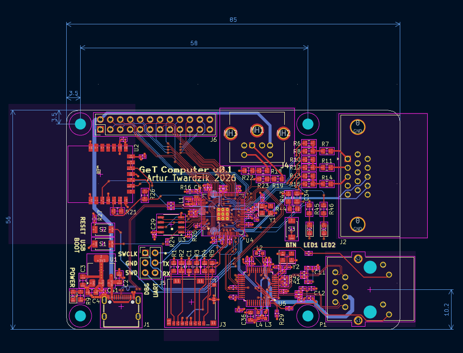
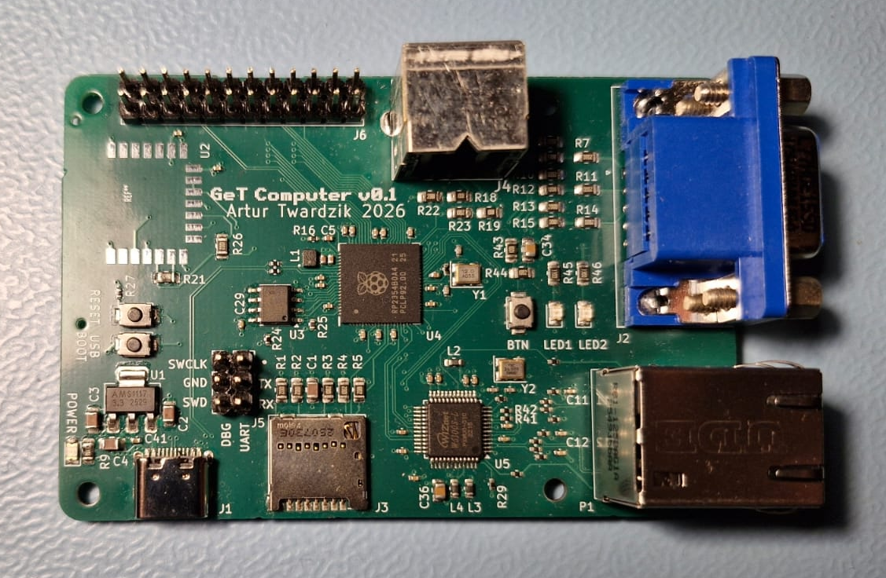

# GeT Computer

A custom-designed single-board computer built with RP2354B MCU. This project serves as a hardware platform for my experimental [operating system](https://github.com/atwardzik/os_kernel). In its form it was inspired by the original Raspberry Pi SBC. However, it features an MCU that is much more managable in terms of low level development, as it is provided with comprehensive [datasheet](https://pip-assets.raspberrypi.com/categories/1214-rp2350/documents/RP-008373-DS-2-rp2350-datasheet.pdf?disposition=inline) covering all details. Additionally, the board includes hardware interfaces (VGA, PS2, microSD) specifically selected for their simplicity in driver implementation. The board also features Ethernet chip by WIZNet and slot for soldering Raspberry Pi Radio Module.

This repository contains the **hardware design files** (KiCad schematics, PCB layout, BOM).

## What's in This Repository

- **KiCad Project Files** (`.kicad_pcb`, `.kicad_sch`, `.kicad_pro`)
- **Bill of Materials (BOM)**
- **Gerber Files** for manufacturing

## Visual Overview

### KiCad Design View

### Physical PCB

## Hardware Specifications

| Feature | Specification |
|---------|---------------|
| Processor | RP2354B |
| RAM | 520KB internal SRAM + 8MB external PSRAM |
| Non-volatile storage | microSD Card |
| Ethernet | WIZnet W5100S |
| WiFi and Bluetooth | Raspberry Pi Radio Module 2 (RM2) |
| IO | VGA@640x480 and PS2 keyboard |
| Power Input | 5V @ 1A |
| Dimensions | 85mm x 56mm x 17mm |
| Stackup | 4-layer with power and ground planes |

## Viewing the Design
1. Install [KiCad](https://www.kicad.org/) (version [9.0+])
2. Open `GeT_Computer.kicad_pro`
3. Explore schematics and PCB layout

## Software

This hardware was designed specifically for the [GeT OS](https://github.com/atwardzik/os_kernel). The OS repo contains:
- Kernel code
- Drivers for peripherals.
- Build instructions

## Contributing
Although the project is already manufactured, feel free to open any issues regarding problems you may have found.

## License
CC BY-NC-SA 4.0

Copyright (c) 2026, Artur Twardzik